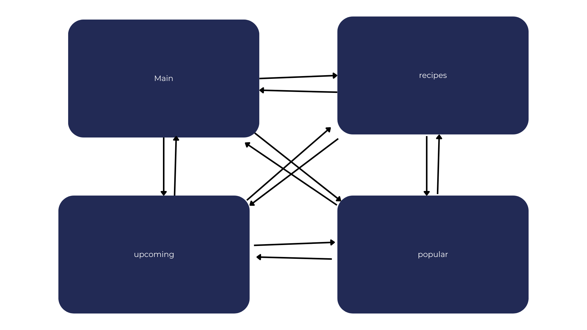

# <ins> **Computing Technology Task 2 2025**<ins>
---
## <ins> **Identifying and Defining** <ins>
---
### <ins> **Divergent Thinking** <ins>
#### **Mind Map**

#### **Ideas**
- Hangout Organiser
- App that can be used by your friend group and tracks screentime alerting everyone if someone goes over
- App that limits screen time
- An app that allows you to jot down things you see online, maybe to remember or do later. Then being able to tick them off or something
- An app that allows you to set a goal and then make increments of checkpoints that allow you track progress towards your goal
- A wellbeing app that encourage you every day, or even just a small widget application that you put on your lock/home screen that encourages you.
- An app that could update everyday with a new quick and easy recipe that is healthy and could replace you going out for fast food

---
### <ins> **Convergent Thinking** <ins>
#### **Impact/Effort**

#### **SWOT Analysis**
**Healthy Recipe Suggestions**

This app would deliver a fresh, quick, and healthy recipe every day, helping users avoid the temptation of fast food. Its strengths lie in promoting better eating habits, keeping users engaged with daily updates, and potentially saving money on takeout. However, it may face challenges in consistently sourcing appealing recipes and catering to diverse dietary needs. Opportunities include partnering with nutritionists or food bloggers, adding features like calorie tracking or budget filters, and monetising through premium content or sponsored ingredients. The app would need to stand out in a crowded market of recipe platforms and maintain user interest to avoid becoming just another forgotten download.

**Goal or Checkpoint App**

This app would empower users to set personal goals and break them down into manageable checkpoints, making progress feel more achievable. Its strengths include flexibility across different goal types, whether fitness, study, or finance, and a structure that encourages motivation and accountability. Weaknesses might include the complexity of designing a user-friendly interface that supports varied goals and the risk of users abandoning their plans without proper nudges. There’s strong potential to integrate with wearable tech, calendars, or gamified features like badges and streaks. Still, it would need to compete with established productivity apps and address privacy concerns around personal data to gain trust and traction.

#### **Reflection**
Some of the ideas I had on the Impact/Effort map would be too ambitious, as well as me not knowing how to actually make most of the things. I have decided to go with the Healthy Recipe Suggestions web app as this would be relatively easy to make as all I need is to update the main page everyday with a new recipe. It does have it's flaws though, them being if the recipes not appealing to the audience, and consistently finding new recipes to upload everyday. There could also be the problem of dietary requirements that some may need and the site cannot guarantee that the recipes will fit these requirements.

---
---
## <ins> **Requirements Outline** <ins>
---
### <ins> **Funcitonal** <ins>
#### **Recipe Delivery**
- The app must deliver one fresh, healthy recipe to users daily.
- Recipes should include ingredients, preparation steps, cooking time, and nutritional info.
- Users should be able to set dietary preferences to receive tailored suggestions.
- Recipes should be sourced from a verified database or curated contributors.

#### **User Interaction**
- Users must be able to create and manage personal profiles.
- The app should allow users to save, rate, and comment on recipes.
- Search and filter options should be available (e.g. budget, prep time, dietary type).
- Push notifications should alert users when a new recipe is available.

#### **Content Management**
- Recipes must be displayed in a clean, readable format with appealing visuals.
- Nutrition facts, cost per serving, and dietary tags should be clearly shown.
- Premium content (e.g. exclusive recipes or expert tips) should be accessible via subscription.
- Admins should be able to add, edit, and remove recipes easily.

---
### <ins> **Non-Functional** <ins>
#### **Performance**
- The app should load recipes and images quickly (under 2 seconds).
- Backend systems must optimize data retrieval to minimize delays.
- The app should run smoothly across mobile and web platforms.

#### **Reliability**
- The app must deliver a new recipe daily without failure.
- User data (saved recipes, preferences) should be securely stored and backed up.
- The system should handle errors gracefully (e.g. missing recipe, failed API call).

#### **Accessibility & Usability**
- The interface must be intuitive and easy to navigate for all age groups.
- Clear instructions should guide users through filtering, saving, and accessing recipes.
- The app should support accessibility features (e.g. screen readers, high contrast mode).

---
---
## <ins> **Researching and Planning** <ins>
---
### <ins> **Exploring Existing Ideas** <ins>
| NAME      | PLUS                                                                                                   | MINUS                                                                                                  | IMPLICATIONS                                                                                          |
|---|---|---|---|
| Instagram | - High engagement through visual content   - Powerful tool for brand marketing and personal branding   - Enables community movements and social awareness | - Can promote unrealistic beauty standards   - Algorithm may prioritise sensitive or misleading content   - Privacy concerns and data usage issues | - Influences fashion, fitness, and lifestyle choices globally   - Drives consumer behavior and purchasing decisions   - Shapes political discourse and activism |
| Amazon    | - Personalised shopping experience   - User reviews guide purchasing decisions   - Efficient logistics and global reach | - Can contribute to overconsumption   - Small businesses may struggle to compete   - Ethical concerns over labor practices | - Alters retail landscapes and shopping habits   - Centralizes consumer trust and purchasing power   - Influences global supply chains and product visibility |
| YouTube   | - Free access to diverse content   - Empowers creators to build communities   - Educational and DIY content widely available | - Misinformation can spread easily   - Ad-driven model may prioritise clickbait   - Content moderation challenges | - Shapes public opinion and learning styles   - Influences youth culture and media consumption   - Democratises content creation and knowledge sharing |

---
### <ins> **Primary Research** <ins>
| Fast Food/Takeaway per Month | Cost per Meal                          | Would Take Healthy Option? | Do you Know How to Cook? |
|-----------------------------|-----------------------------------------|-----------------------------|------------------|
| 5                           | My parents usually pay. $10–$15         | Maybe                       | 6                |
| 5                           | Per meal around $4                      | Yes                         | 7                |
| 10+                          | $15                                     | Yes                         | 5                |
| 10+                          | $20–$30                                  | Maybe                       | 1                |
| 4                           | 16 dolla                                | No                          | 3                |
| 2                           | $3                                      | Maybe                       | 1                |
| 3                           | For the whole family $50-ish            | Yes                         | 6                |
| 3                           | $1–$50                                   | Yes                         | 1                |
| 10+                          | 67 doll hairs                           | No                          | 1                |
| 5                           | 14.5 c                                  | Maybe                       | 1                |
| 4                           | Around $80                              | Yes                         | 1                |
| 9                           | $10                                     | Yes                         | 7                |
| 5                           | $10–$15                                  | Maybe                       | 4                |
| 3                           | Approx $15 for myself                   | Yes                         | 5                |

#### **Evaluation Of Data**
The survey results show that fast food and takeaway are a regular part of many people's lives, with most respondents eating it between three and ten times a month. Spending habits vary widely, from as little as $3 to over $80 per meal, especially when buying for the whole family. This suggests that while fast food is often seen as affordable, it can add up quickly depending on the situation. Cooking skills also varied, with several respondents rating themselves low in confidence or ability. This highlights a potential barrier to healthy eating, as many people may want to cook but feel unsure about how to start.

Importantly, most participants said they would consider switching to a healthy and cheap option if it were available. Only two respondents said “no,” while the rest responded with “yes” or “maybe.” This shows a strong interest in alternatives to fast food, especially if those options are easy to make and budget-friendly. The qualitative feedback suggests that convenience and cost are key factors in food choices, and that people are open to change if the new option fits their lifestyle.

#### **Impact on Project**
These findings strongly support the direction of the recipe website, which aims to share healthy and affordable meals every day. The data shows that the target audience is already spending money on quick meals, and many are open to healthier alternatives. By offering recipes that are simple, cheap and fast to prepare, the site can meet the needs of people who want better options but may lack cooking skills or time.

To make the platform even more effective, it could include features like cost per serve and cooking time. This would help users feel more confident in the kitchen and show that healthy eating does not have to be expensive or complicated. Recipes tailored for families and younger users may also be beneficial, since they are the most frequent consumers of fast food.

---
### <ins> **Secondary Research** <ins>
Recent research shows that fast food is a major part of many Australians’ diets. Roy Morgan reports that over 15.9 million Australians aged 14 and over (about 75 percent of the population) ate takeaway food from fast food outlets like McDonald’s, KFC and Hungry Jack’s in an average four-week period. Nearly one in five Australians eat fast food ten or more times in that same time frame. Millennials are the biggest customers, with over 2.5 million visiting McDonald’s alone. The Cancer Council says that the average fast food meal provides around 47 percent of an adult’s daily energy needs. Australian households spend about 28 percent of their food budget on fast food and eating out.

This has serious health impacts. The Australian Bureau of Statistics found that two-thirds of adults and nearly one-quarter of children are overweight or obese. Poor diet and lack of physical activity are major causes, and fast food is often high in sugar, salt and saturated fat. Regular consumption can lead to obesity, type 2 diabetes, heart disease and even some types of cancer. In fact, high body mass was responsible for 7 percent of all disease and injury burden in Australia in 2017.

These stats show there is a real need for better food options. People clearly want quick meals, but they often choose fast food because it is easy and affordable. This site could offer recipes that are just as fast, but much healthier and cheaper. To make it even more useful, it could include things like cooking time, cost per serve and nutrition info. This project could help shift habits and make healthy eating the new normal.

---
### <ins> **UI/UX Design And Prototype** <ins>
#### **Website Flow**

[link to figma](https://www.figma.com/design/5YlNSW46Ws9hMMj0UIztTd/Untitled?node-id=0-1&t=u8Dp7FXwky3MBxUR-1)

I think that this design for the website will make it intuitive and easy to navigate, as well as suiting the need of my website nicely. Obviously you would need a picture of the meal so that the users can see what they're end product should/could look like. Using photos also draws their attention as no one is reading the recipe to decide if they want to eat that or not.

---
---
## <ins> **Producing and Implementing** <ins>
---
